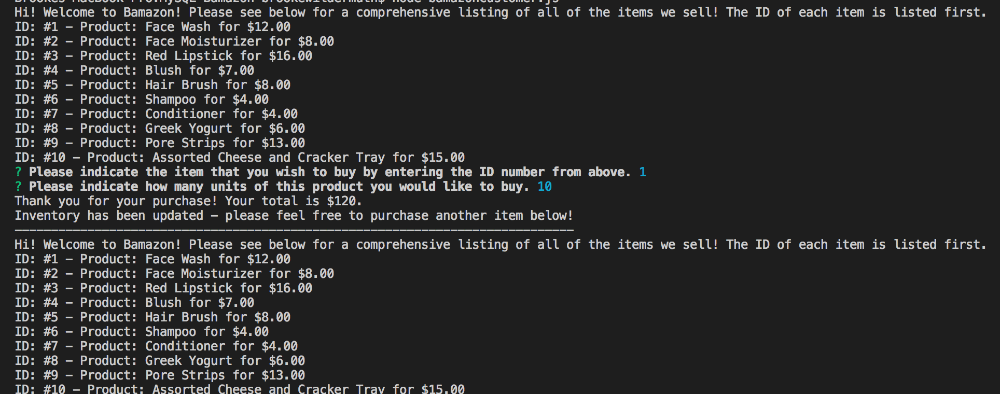

# MySQL-Bamazon
Node application utilizing MySQL to create an Amazon-like store

If you are acting as the Customer please run node bamazonCustomer.js this will display a list of the products from our Bamazon
store.

The application will then prompt the following two questions:

1) Please indicate the item that you wish to buy by entering the ID number from above. (This number should be 1 - 10.)
2) Please indicate how many units of this product you wouldlike to buy. (This number is infinite but you might not be able 
to purchase it depending on the stock quantity!)

The application will either:

1) Thank you for your purchase along with how much you owe or
2) Indicate that our store does not have sufficient quantity.

Please see a screenshot of an example purchase.

